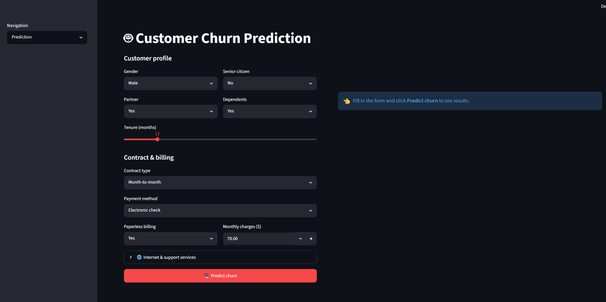
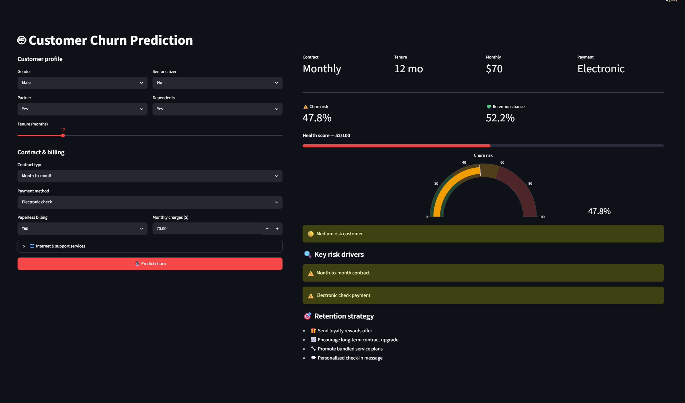
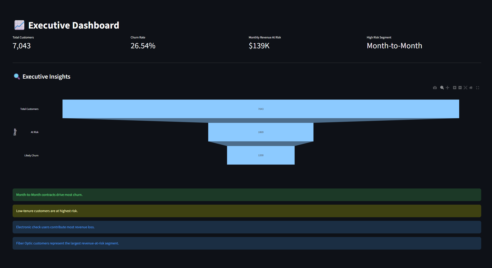
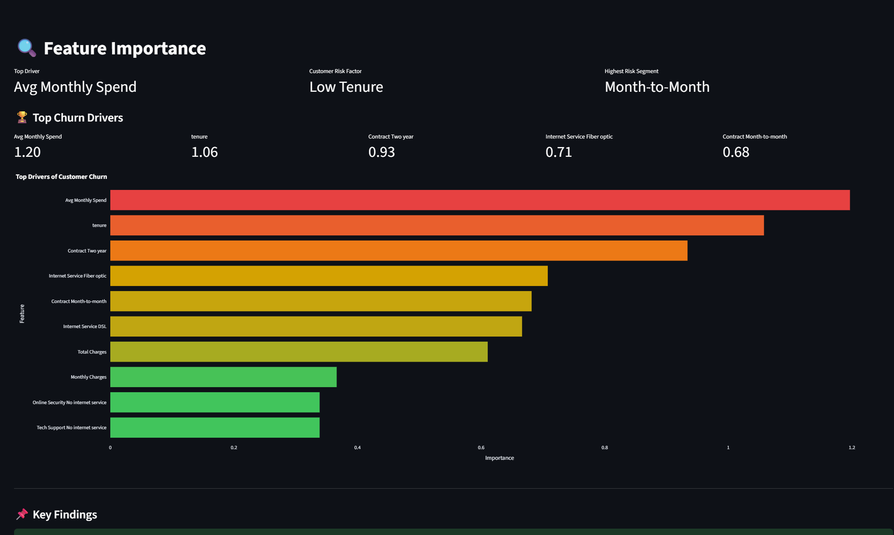
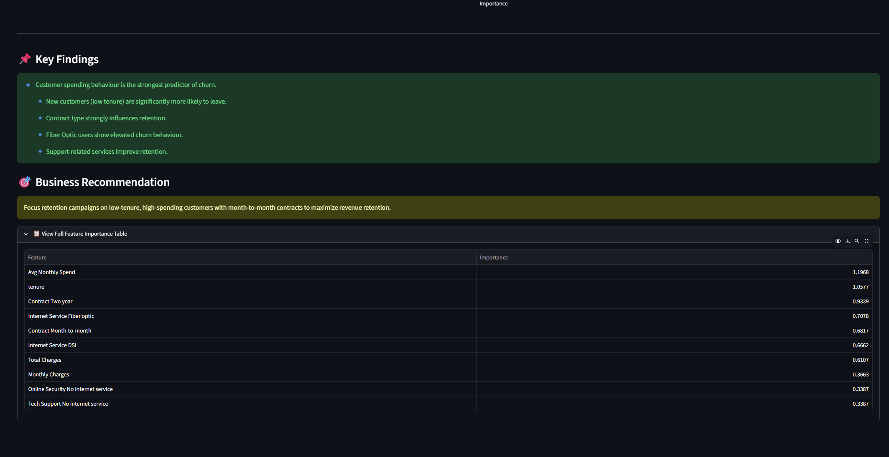

<<<<<<< HEAD
# Telco Customer Churn Prediction
=======
# Telco Customer Churn Prediction & Retention Analytics
>>>>>>> e162292 (Added business analytics dashboards and updated README)

## Overview

This project is an end-to-end Machine Learning and Business Analytics solution designed to predict customer churn in a telecommunications company and identify key business drivers behind customer attrition.

The project covers:

- Data Cleaning and Preprocessing
- Exploratory Data Analysis (EDA)
- Feature Engineering
- Machine Learning Model Development
- Customer Segmentation
- Revenue Impact Analysis
- Executive Business Dashboard
- Interactive Streamlit Deployment

---

<<<<<<< HEAD
## Project Highlights
=======
## Dataset
>>>>>>> e162292 (Added business analytics dashboards and updated README)

Source: IBM Telco Customer Churn Dataset

Dataset Link:
https://www.kaggle.com/datasets/blastchar/telco-customer-churn

Dataset Summary:

- Customers: 7,043
- Features: 21
- Target Variable: Churn (Yes/No)
- Domain: Telecommunications

---

## Project Structure

```text
Tele Customer Churn/
│
├── data/
│   └── WA_Fn-UseC_-Telco-Customer-Churn.csv
│
├── models/
│   ├── feature_importance.csv
│   ├── customer_segments.csv
│   └── customer_segment_churn.csv
│
├── outputs/
│   └── figures/
│
├── sql/
│   ├── churn_analysis.sql
│   ├── revenue_analysis.sql
│   └── customer_segments.sql
│
├── src/
│   ├── eda.py
│   ├── preprocess.py
│   ├── train.py
│   ├── revenue_analysis.py
│   ├── customer_segmentation.py
│   └── executive_summary.py
│
├── app.py
├── requirements.txt
└── README.md
```

---

<<<<<<< HEAD
##  Dataset

**Source:** IBM Telco Customer Churn Dataset

### Dataset Information

- Total Customers: 7,043
- Features: 21
- Target Variable: Churn (Yes/No)
- Domain: Telecommunications

### Feature Categories

- Customer Demographics
- Account Information
- Internet Services
- Support Services
- Billing Information
- Contract Details

---

##  Exploratory Data Analysis
=======
## Data Cleaning
>>>>>>> e162292 (Added business analytics dashboards and updated README)

Performed:

- Converted TotalCharges to numeric format
- Handled missing values using median imputation
- Removed duplicate records
- Removed customerID column
- Validated data types

---

<<<<<<< HEAD
## Data Cleaning
=======
## Feature Engineering
>>>>>>> e162292 (Added business analytics dashboards and updated README)

Created the following features:

<<<<<<< HEAD
- Converted `TotalCharges` to numeric format.
- Handled missing values using median imputation.
- Removed unnecessary customer identifiers.
- Removed duplicate records.

### Dataset Shape

| Stage            | Rows |
| ---------------- | ---- |
| Original Dataset | 7043 |
| After Cleaning   | 7021 |

---

## Feature Engineering

### Features Created

#### AvgMonthlySpend
=======
### AvgMonthlySpend
>>>>>>> e162292 (Added business analytics dashboards and updated README)

```python
TotalCharges / (tenure + 1)
```

Represents customer spending behaviour.

### HasSupport

```python
OnlineSecurity OR TechSupport
```

Captures whether the customer uses support-related services.

---

## Models Trained

| Model               | Accuracy | Precision | Recall | F1 Score | ROC-AUC |
| ------------------- | -------: | --------: | -----: | -------: | ------: |
| Logistic Regression |   80.21% |    66.43% | 51.08% |   57.75% |  84.14% |
| Random Forest       |   77.86% |    61.01% | 45.43% |   52.08% |  81.54% |
| XGBoost             |   80.00% |    65.42% | 51.88% |   57.87% |  83.96% |

### Selected Model

Logistic Regression was selected because it achieved the highest ROC-AUC while maintaining strong predictive performance and providing greater interpretability for business stakeholders.

---

<<<<<<< HEAD
## Best Model
=======
## Key Churn Drivers
>>>>>>> e162292 (Added business analytics dashboards and updated README)

The most influential features identified by the model include:

<<<<<<< HEAD
Selected based on:

- Highest ROC-AUC Score
- Strong overall performance
- Faster inference
- Better interpretability

---

## Feature Importance

Top churn-driving features identified:

1. Contract Type
=======
1. Avg Monthly Spend
>>>>>>> e162292 (Added business analytics dashboards and updated README)
2. Tenure
3. Contract Type
4. Internet Service Type
5. Monthly Charges

Business Insight:

Customers with higher spending, shorter tenure, and month-to-month contracts are significantly more likely to churn.

---

<<<<<<< HEAD
## Streamlit Dashboard
=======
## Revenue Impact Analysis
>>>>>>> e162292 (Added business analytics dashboards and updated README)

### Monthly Revenue at Risk

<<<<<<< HEAD
### Home
=======
$139,130
>>>>>>> e162292 (Added business analytics dashboards and updated README)

### Historical Spend of Churned Customers

<<<<<<< HEAD
### Prediction
=======
$2.86 Million

Key Findings:

- Month-to-month customers contribute the largest revenue loss.
- Fiber Optic customers represent the highest-risk service segment.
- Electronic Check users generate the greatest revenue loss.

---

## Customer Segmentation

Customer Lifetime Value (CLTV) was calculated as:

```python
CLTV = MonthlyCharges × tenure
```

### Segment Distribution

| Segment      | Customers | Churn Rate |
| ------------ | --------: | ---------: |
| High Value   |     1,761 |     14.48% |
| Medium Value |     3,524 |     24.32% |
| Low Value    |     1,758 |     43.06% |

Key Finding:

Low-value customers exhibit nearly three times the churn rate of high-value customers.

---

## Executive Insights

1. Month-to-month contracts drive the majority of churn.
2. Customers with tenure below 12 months are most vulnerable.
3. Electronic Check customers contribute the highest revenue loss.
4. Fiber Optic users represent the largest at-risk customer segment.
5. Support services improve customer retention.

---

## Streamlit Dashboard

The application includes:

- Home Dashboard
- Churn Prediction
- Model Performance
- EDA Dashboard
- Feature Importance
- Revenue Dashboard
- Customer Segmentation
- Executive Dashboard

Features:
>>>>>>> e162292 (Added business analytics dashboards and updated README)

- Real-time churn prediction
- Customer health score
- Risk analysis
- Business recommendations
<<<<<<< HEAD

### EDA Dashboard

- Churn visualizations
- Customer behavior insights

### 🏆 Model Performance

- Comparison of all trained models
- Performance metrics

### Feature Importance

- Top churn drivers
- Business insights

---

## Business Impact
=======
- Revenue analytics
- Customer segmentation insights

---

## Screenshots
>>>>>>> e162292 (Added business analytics dashboards and updated README)

### Prediction Dashboard




### Executive Dashboard



### Feature Importance Dashboard




---

<<<<<<< HEAD
## Tech Stack
=======
## SQL Analytics
>>>>>>> e162292 (Added business analytics dashboards and updated README)

The project includes SQL-based business analysis queries:

- Churn Rate Analysis
- Revenue-at-Risk Analysis
- Customer Segmentation Analysis

Files:

```text
sql/
├── churn_analysis.sql
├── revenue_analysis.sql
└── customer_segments.sql
```

---

## Tech Stack

Programming:

- Python

Data Analysis:

- Pandas
- NumPy

Visualization:

- Matplotlib
- Seaborn
- Plotly

Machine Learning:

- Scikit-Learn
- XGBoost

Deployment:

- Streamlit

Model Serialization:

- Joblib

---

## How to Run

Install dependencies:

```bash
pip install -r requirements.txt
```

Generate EDA visualizations:

```bash
python src/eda.py
```

Train models:

```bash
python src/train.py
```

Generate business analytics:

```bash
python src/revenue_analysis.py
python src/customer_segmentation.py
python src/executive_summary.py
```

Launch dashboard:

```bash
streamlit run app.py
```

---

## Requirements

```text
pandas
numpy
matplotlib
seaborn
scikit-learn
xgboost
streamlit
plotly
joblib
```

---

## Author

Neha Vijetha Dasari

Engineering Physics, IIT Hyderabad

## Skills Demonstrated

- Data Cleaning
- Exploratory Data Analysis
- Feature Engineering
- Machine Learning
- Customer Segmentation
- Revenue Analytics
- SQL Analytics
- Business Intelligence
- Data Visualization
- Streamlit Application Development
